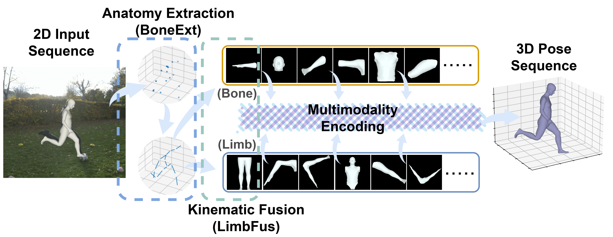

# KASportsFormer: Kinematic Anatomy Enhanced Transformer for 3D Human Pose Estimation on Short Sports Scene Videos

<a href="https://pytorch.org/get-started/locally/"></a> [](https://arxiv.org/abs/2507.20763) 

<a href="https://jw0r1n.github.io/KASportsFormer"></a>

This is the official PyTorch implementation of the paper "KASportsFormer: Kinematic Anatomy Enhanced Transformer for 3D Human Pose Estimation on Short Sports Scene Videos".




## Environment

The project is developed under the following environment:

- Python 3.9.19
- PyTorch 2.3.1
- CUDA 12.1

For installation of the project dependencies, please run:

```
pip install -r requirements.txt
``` 

## Dataset

### Dataset Preprocessing

This project utilizes two sports datasets for training and evaluation of 3D Human Estimation: [SportsPose](https://github.com/ChristianIngwersen/SportsPose) and [WorldPose](https://eth-ait.github.io/WorldPoseDataset/).

We follow the [MotionBERT](https://github.com/Walter0807/MotionBERT)'s dataset source file structure for an easier training and evaluation process. We apply a preprocessing step to convert the original dataset into the *"Detection Data"* and *"GT Data"* separated format.

For the detailed instruction of how we preprocess the datasets, please refer to the following tools:

* [SportsPose Preprocessing Tool](https://github.com/yydrowz3/sportspose-preprocess-tool)
* [WorldPose Preprocessing Tool](https://github.com/yydrowz3/worldpose-preprocess)

or you can download our preprocessed source files:

* `sp_hr_conf_cam_source_1camera.pkl`
* `sp_no_conf_cam_source_final.pkl`
* `wp_hr_conf_cam_source_final.pkl`
* `wp_no_conf_cam_source_final.pkl`

from [Google Drive](https://drive.google.com/drive/folders/1KLaEvHBiiGOMqoBvafzn-a-285G0ZyA5?usp=sharing), and put them into the directory `./data/`.

### Dataset Preparation

In consistency with the MotionBERT's training procedure, we slice into the data clips according to the frame length.

Please run our *preprocessor* in the `data/preprocessor` directory:

```shell
cd ./data/preprocessor
```

you can change the `n-frames` parameter to slice data clips of different sequence lengths and the `data-type` parameter to specify whether you want to slice the detection data or the ground truth data.

- For **SportsPose** detection data and GT data of `27` frame length clips:

```shell
python clip_generate_sp.py --data-type det --n-frames 27
```

```shell
python clip_generate_sp.py --data-type gt --n-frames 27
```

- For **WorldPose** detection data and GT data of `27` frame length clips:


```shell
python clip_generate_wp.py --data-type det --n-frames 27
```

```shell
python clip_generate_wp.py --data-type gt --n-frames 27
```

## Training

After dataset preparation, you can train the model as follows:

First, please **change** the necessary parameters of model configuration to your situation before training. The configuration files are stored in the `./configs` directory. 

> You can also use [weight and biases](wandb.ai) for logging the training and validation error by turning on `use_wandb=True` in the config.

### SportsPose

For training on SportsPose dataset, please run the following command:

```
python train_and_evaluate_sp.py --config <PATH-TO-CONFIG>
```

> For example
> ```
> python train_and_evaluate_sp.py --config configs/sportspose-gt-kasportsformer.yaml
> ```

### WorldPose

For training on WorldPose dataset, please run the following command:

```
python train_and_evaluate_wp.py --config <PATH-TO-CONFIG>
```


## Evaluation

You can download our checkpoints for evaluation.

| Checkpoints               | SportsPose | WorldPose | Detection | Ground-Truth | Download                                                                                       |
|---------------------------|------------|-----------|-----------|--------------|------------------------------------------------------------------------------------------------|
| kasportsformer-sp-det.pth | ✅          | ❌         | ✅         | ❌            | [Google Drive](https://drive.google.com/file/d/1wz_z42YeAnniPYDxep1J8ncH-ykodF8m/view?usp=sharing)                                                                               |
| kasportsformer-sp-gt.pth  | ✅          | ❌         | ❌         | ✅            | [Google Drive](https://drive.google.com/file/d/1wBb5IdFXxyQA3zBVtjfyCKgoVrXpPTKx/view?usp=sharing)                                                                               |
| kasportsformer-wp-det.pth | ❌          | ✅         | ✅         | ❌            | [Google Drive](https://drive.google.com/file/d/1OB5GKQrVeRJ8I-2XWnzYC_SpZCN1vBHG/view?usp=sharing)                                                                          |
| kasportsformer-wp-gt.pth  | ❌          | ✅         | ❌         | ✅            | [Google Drive](https://drive.google.com/file/d/1c--q52nZL7705ljiM0NZgY5EfOHm_gZ5/view?usp=sharing) |

After downloading the weight from table above, turn on the `eval_only=True` in the config file and set the correct **checkpoint path**.

you can evaluate on SportsPose dataset by:

```
python train_and_evaluate_sp.py --config <PATH-TO-CONFIG>
```

Similarly, WorldPose can be evaluated by:

```
python train_and_evaluate_wp.py --config <PATH-TO-CONFIG>
```


## Demo
Our demo is a modified version of the one provided by [MotionAGFormer](https://github.com/TaatiTeam/MotionAGFormer) repository. 

First, you need to download **YOLOv3** and **HRNet** pretrained models [here](https://drive.google.com/drive/folders/1_ENAMOsPM7FXmdYRbkwbFHgzQq_B_NQA?usp=sharing) and put it in the `./demo/lib/checkpoint` directory. 

Next, download our model checkpoint or your self-trained model and put it in the `./checkpoint/evaluate_checkpoint` directory or somewhere else. Then, you need to put your in-the-wild videos in the `./demo/video` directory.

Run the command below with parameters:

```shell
cd demo
python demo.py \
  --video sample_video.mp4 
  --config ../configs/sportspose-kasportsformer.yaml 
  --model ../checkpoint/evaluate_checkpoint/kasportsformer-sportspose.pth
  --elev 20 --azim 30
```

Sample demo will be saved in the `./demo/output/(your video name)` directory.

<p align="center"></p>

## Acknowledgement

Our code refers to and builds on the following repositories:

- [MotionAGFormer](https://github.com/Walter0807/MotionBERT)
- [SportsPose](https://github.com/ChristianIngwersen/SportsPose)
- [WorldPose](https://eth-ait.github.io/WorldPoseDataset/)

We appreciate the authors for their invaluable codes and data release.

## Citation

If you find our work useful for your project, please consider citing the paper:

```
@misc{yin2025kasportsformer,
      title={KASportsFormer: Kinematic Anatomy Enhanced Transformer for 3D Human Pose Estimation on Short Sports Scene Video}, 
      author={Zhuoer Yin and Calvin Yeung and Tomohiro Suzuki and Ryota Tanaka and Keisuke Fujii},
      year={2025},
      eprint={2507.20763},
      archivePrefix={arXiv},
      primaryClass={cs.CV},
      url={https://arxiv.org/abs/2507.20763}, 
}
```

## License

This project is available under Apache-2.0 License. Please refer to LICENSE for more information.


